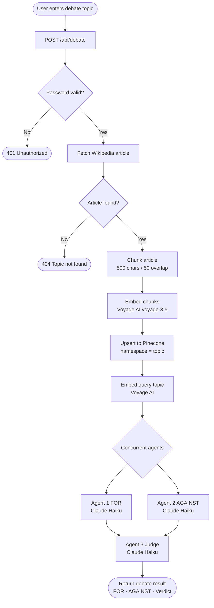

# 🎭 Multi-Agent RAG Debate Arena


A multi-agent AI system where **three Claude Haiku agents** debate any topic using real Wikipedia knowledge — one argues FOR, one AGAINST, and a third judges the winner. Built on a full RAG (Retrieval-Augmented Generation) pipeline with vector search.

> 💡 **Inspired by** [AWS Medallion Pipeline with AI Diagnostic Agent](https://github.com/Dream-Johnson/aws-medallion-pipeline-ai-agent) — where I first built an AI agent to automate debugging in a data pipeline. This project extends that idea: instead of one agent diagnosing a problem, three agents reason, argue, and evaluate together.

---

## 🏗️ System Architecture

```
┌─────────────────────────────────────────────────────────────────┐
│                        DEBATE ARENA                             │
│                                                                 │
│   Browser (Vanilla JS)                                          │
│       │                                                         │
│       │  POST /api/debate  {topic}                              │
│       ▼                                                         │
│   FastAPI Backend                                               │
│       │                                                         │
│       ├──► RAG Ingestion Pipeline                               │
│       │         │                                               │
│       │         ├──► Wikipedia API  ──► Article Text            │
│       │         ├──► Text Chunker   ──► ~30 chunks              │
│       │         ├──► Voyage AI      ──► 1024-dim embeddings     │
│       │         └──► Pinecone DB    ──► stored by namespace     │
│       │                                                         │
│       ├──► Agent 1 (FOR)  ◄── retrieves top-5 chunks           │
│       ├──► Agent 2 (AGAINST) ◄── retrieves top-5 chunks        │
│       │    [runs concurrently via asyncio.gather]               │
│       │                                                         │
│       └──► Agent 3 (Judge) ◄── scores both, declares winner    │
│                                                                 │
│   ◄── Returns: for_argument, against_argument, verdict          │
└─────────────────────────────────────────────────────────────────┘
```

---

## 🔄 Pipeline Flowchart



---

## 🤖 The Three Agents

| Agent | Role | Context Source |
|-------|------|---------------|
| **Agent 1 — FOR** | Argues in favour of the topic | Top-5 chunks retrieved from Pinecone via vector similarity |
| **Agent 2 — AGAINST** | Argues against the topic | Top-5 chunks retrieved from Pinecone via vector similarity |
| **Agent 3 — Judge** | Scores both arguments, declares a winner | The two generated arguments (no direct RAG retrieval) |

All three are powered by **Claude Haiku** (`claude-haiku-4-5`) and include **prompt injection guardrails** — Wikipedia content and user topics are tagged as untrusted data and can never override agent instructions.

---

## 🛠️ Tech Stack

| Layer | Technology | Purpose |
|-------|-----------|---------|
| **LLM** | Anthropic Claude Haiku | All 3 debate agents |
| **Embeddings** | Voyage AI `voyage-3.5` | 1024-dim asymmetric embeddings |
| **Vector DB** | Pinecone (Serverless) | Store & retrieve article chunks |
| **Retrieval** | Wikipedia REST API | Source knowledge per topic |
| **Backend** | FastAPI + Python 3.11 | Async API, auth, orchestration |
| **Frontend** | Vanilla HTML/CSS/JS | No framework, no build step |
| **Chunking** | LangChain `RecursiveCharacterTextSplitter` | 500 char chunks, 50 overlap |

---

## 🔐 Security

- Password-gated API — every endpoint requires `X-App-Password` header
- Timing-attack-safe comparison via `secrets.compare_digest()`
- **Prompt injection defence**: user topic and Wikipedia content are wrapped in `<topic>` and `<retrieved_context>` tags with explicit system-prompt rules telling Claude to treat them as data, never as instructions

---

## 🚀 Running Locally

### Prerequisites
- Python 3.11+
- [`uv`](https://docs.astral.sh/uv/) (dependency manager)
- API keys: Anthropic, Voyage AI, Pinecone

### Setup

```bash
git clone https://github.com/Dream-Johnson/multi-agent-RAG-Debate-Arena.git
cd multi-agent-RAG-Debate-Arena/backend

# Install dependencies
uv sync

# Configure environment
cp .env.example .env
# Fill in your API keys in .env

# Start the server
uv run uvicorn main:app --host 127.0.0.1 --port 8000
```

Open `http://localhost:8000` in your browser.

---

## 📁 Project Structure

```
multi-agent-RAG-Debate-Arena/
├── backend/
│   ├── main.py              # FastAPI app, routes, static file mount
│   ├── debate.py            # Orchestrator: RAG ingestion → agents → judge
│   ├── agents.py            # 3 Claude Haiku agents + prompt guardrails
│   ├── embeddings.py        # Voyage AI async embedding (document + query)
│   ├── vectorstore.py       # Pinecone upsert + query by namespace
│   ├── wikipedia_service.py # Wikipedia fetch with HTTP/2 (httpx)
│   ├── chunking.py          # RecursiveCharacterTextSplitter wrapper
│   ├── auth.py              # Header-based password gate
│   ├── config.py            # Pydantic settings from .env
│   ├── models.py            # DebateRequest / DebateResult schemas
│   ├── pyproject.toml       # uv-managed dependencies
│   └── .env.example         # API key template
└── frontend/
    ├── index.html           # Login + app screens
    ├── style.css            # Design tokens, OKLCH palette, dark mode
    └── app.js               # State machine, fetch, staged loading UX
```

---

## 💡 Key Engineering Decisions

- **Async-first**: `asyncio.gather()` runs FOR and AGAINST agents concurrently, cutting wait time roughly in half
- **HTTP/2 for Wikipedia**: Wikimedia blocks HTTP/1.1 from non-browser clients with 403 — `httpx[http2]` solves this
- **Lazy Pinecone init**: index creation only happens on first debate request, not at server startup — broken Pinecone credentials don't take down the login page
- **Namespace isolation**: each topic gets its own Pinecone namespace so retrieval for one debate never pollutes another

---

## 🔗 Related Projects

- [AWS Medallion Pipeline with AI Diagnostic Agent](https://github.com/Dream-Johnson/aws-medallion-pipeline-ai-agent) — the project that inspired this one: an AI agent that auto-diagnoses pipeline failures and emails engineers a fix
